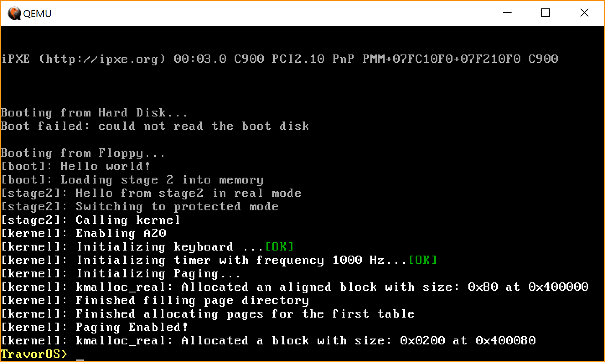

# TravorOS - Developing with Simplification

This is the first [Operating System](https://en.wikipedia.org/wiki/Operating_System "Operating System Definition") I created. It's written in two languages: C language and Assembly.

This project has been activated since [December 15, 2017](https://github.com/TravorLZH/TravorOS/blob/master/ChangeLog.md#01-r0-2017-12-15)

### Bootloader

This OS uses a bootloader that switches from **16-bit real mode** to **32-bit protected mode**. It loads kernel code into memory address 0x1000 before it entered 32-bit protected mode.

### Kernel

We entered protected mode which means we don't have access to BIOS functions. So, this kernel needs to reimplement those functions for controlling the hardware.

Now, I have reimplemented standard devices: screen and keyboard. In the further development. I am going to implement disk driver.

### Building System

This project proves the greatest utility of [GNU Make](https://www.gnu.org/software/make "GNU Make Homepage") in the way it builds an Operating System.

This project contains almost 3000 lines of code, but only 48 lines of Makefile code is needed for build.
